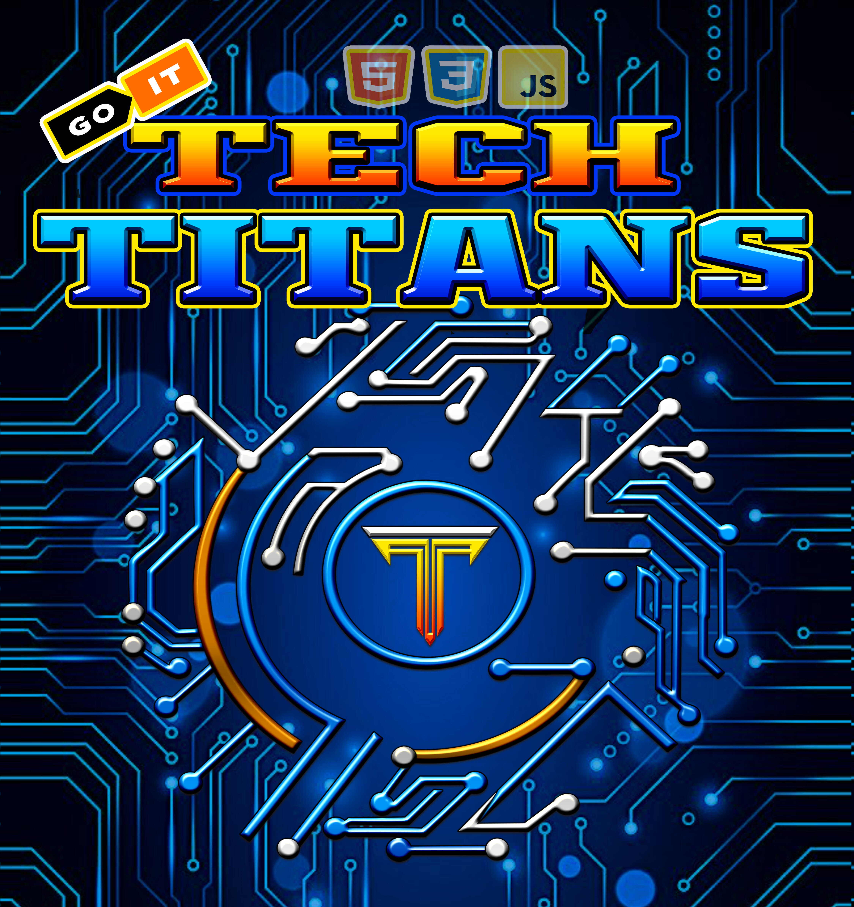

<h1 align="center"> 👨‍💻 GOIT Team Project 👩‍💻 </h1>
<h2 align="center">  FILMOTEKA 🎥 </h2>
<h3 align="center">  Tech Titans | Group 2 </h3>

&nbsp;
&nbsp;
&nbsp;

&nbsp;
&nbsp;
&nbsp;

&nbsp;
&nbsp;

<h1 align="center" > ℹ️ Team  🚀 </h1>
<h3 align="center"></h3>

   

## Description

The project is implemented in Vanilla JavaScript and working with:

🛠 [the Movie Database TMDB](https://www.themoviedb.org/);

🛠 responsive design for use on phone 📱, tablet 📟 and desktop 💻.

We are students of the FullStack Developer of
, the
project is written at the end of the study of JavaScript.

## How to use Filmoteka?

📽 It is the site for searching and collecting movies.

**The Web App provides the following functions:**

🎞 search movie by a key word;

🎞 manage your film database by adding or deleting chosen movie to WATCHED or to
QUEUE;

🎞 pagination allows you to easily navigate between movies;

🎞 in LIBRARY you can see your database of movies divided by 2 categories:
WATCHED and QUEUE.

